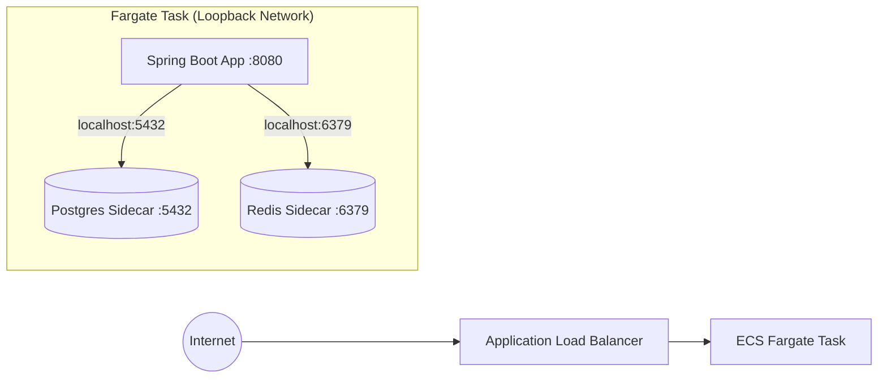
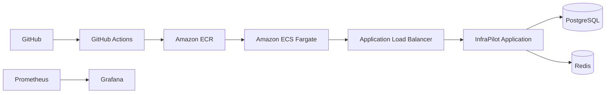
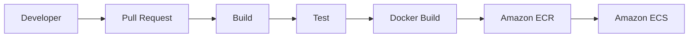
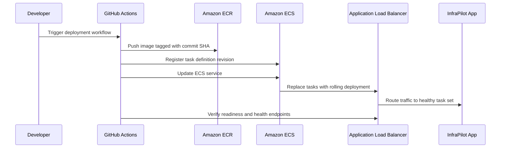
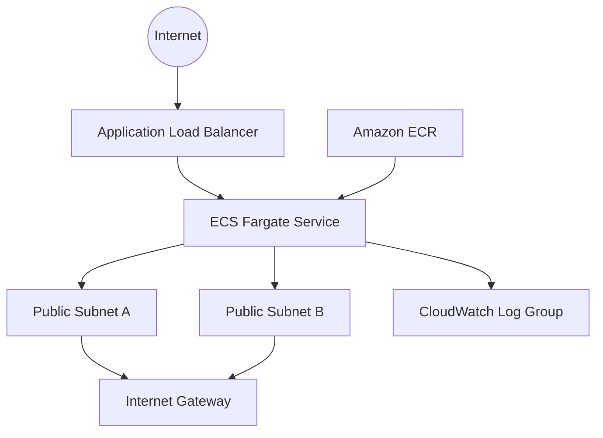
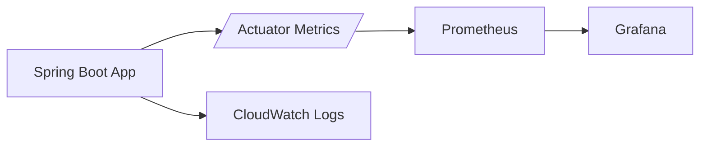

# InfraPilot

InfraPilot is a production-grade cloud-native platform showcase built to demonstrate modern Java backend engineering, AWS infrastructure, CI/CD automation, observability, security, and containerization.

It is intentionally not a business application. The API surface is deliberately small so the repository can focus on platform concerns rather than domain complexity.

---

## 🚀 What We Achieved & Core Architecture

With this codebase, we have designed and provisioned a **high-availability, zero-baseline-cost AWS cloud infrastructure** by running PostgreSQL and Redis as sidecar containers inside a serverless ECS Fargate task:



### Core Value Proposition & Achievements:
* **Zero Database Base Cost:** PostgreSQL and Redis run directly inside the Fargate task memory space, bypassing the high monthly fees of AWS RDS ($15+/mo) and AWS ElastiCache ($15+/mo).
* **NAT Gateway Avoidance:** By placing Fargate tasks directly in public subnets protected by ingress-restricted Security Groups, we avoid the baseline cost of an AWS NAT Gateway ($32/mo).
* **Enterprise Security Posture:** Uses a **multi-stage distroless build** containing *only* the compiled application jar and its JDK runtime. No shell, package manager, or system utilities exist inside the container, reducing the remote code execution exploit surface to nearly zero.
* **Granular CI/CD Triggers:** Integrated path-filtering so pushing markdown or Terraform changes does not trigger Java compiles, keeping build queues fast and cost-efficient.

---

## 🛠️ What You Will Learn From This Repository

Maintaining this repository teaches you critical skills required of **Staff Cloud Engineers** and **SREs**:
1. **Infrastructure as Code (IaC):** Writing modular, variable-driven Terraform configs, managing resource dependencies, and understanding state lifecycles.
2. **Docker Optimization:** Using multi-stage caching, distroless images, non-root execution, and Fargate multi-container networking.
3. **Advanced CI/CD Automation:** Designing branch-to-environment mapping (`main` to `prod`, `stage` to `stage` environment), GitOps practices, and environment parameter injection.
4. **Cloud Operations & Observability:** Configuring ALB health check target groups, grace periods, CloudWatch logging streams, and Actuator metrics endpoints.

---

## Architecture Overview



## CI/CD Pipeline



## Deployment Flow



## AWS Infrastructure Diagram



## Monitoring Architecture



## Repository Layout

```text
infra-pilot
├── application
├── docker
├── terraform
├── monitoring
├── docs
├── .github
└── README.md
```

---

## Local Setup

### Prerequisites

- Java 21
- Maven 3.9+
- Docker Desktop
- PostgreSQL and Redis if you want to run the application outside Compose

### Run locally with Maven

Set the required environment variables first:

- `INFRAPILOT_APP_NAME`
- `INFRAPILOT_APP_VERSION`
- `INFRAPILOT_GIT_COMMIT_SHA`
- `INFRAPILOT_BUILD_TIMESTAMP`
- `INFRAPILOT_HOSTNAME`
- `INFRAPILOT_ENVIRONMENT`
- `SPRING_DATASOURCE_URL`
- `SPRING_DATASOURCE_USERNAME`
- `SPRING_DATASOURCE_PASSWORD`
- `SPRING_REDIS_HOST`
- `SPRING_REDIS_PORT`
- `SPRING_REDIS_PASSWORD`

Then run:

```bash
mvn -pl application -am spring-boot:run
```

### Health check

```bash
curl http://localhost:8080/api/v1/health
```

## Docker Setup

Build and start the full local stack:

```bash
docker compose up --build
```

Services:

- Application: `http://localhost:8080`
- Prometheus: `http://localhost:9090`
- Grafana: `http://localhost:3000`

Default local credentials for Grafana:

- Username: `admin`
- Password: `admin`

## Terraform Setup

Terraform provisions:

- VPC, 2 public subnets, route tables, IGW
- Security groups for ALB and ECS tasks
- ECR repository
- ECS cluster and Fargate service
- Application Load Balancer & Target Group
- CloudWatch log group
- IAM task execution and task roles

See the full step-by-step guide in [docs/terraform.md](docs/terraform.md).

Deploy with minimal inputs:

```bash
cd terraform
terraform init
terraform plan \
  -var="container_image=516292808313.dkr.ecr.us-east-1.amazonaws.com/infrapilot:latest" \
  -var="app_version=1.0.0"
```

## AWS Deployment Guide

1. Apply Terraform.
2. Push your Spring Boot Docker image to ECR.
3. Trigger the deployment workflow in GitHub Actions.
4. Confirm the ECS service reaches `stable`.
5. Verify `/actuator/health/readiness` and `/api/v1/health` through the ALB.

### Rolling deployment strategy

- ECS service uses rolling updates.
- Minimum healthy percent is 100.
- Maximum percent is 200.
- ALB health checks use `/actuator/health/readiness`.
- Deployment fails if health checks do not recover.

### Rollback

- Re-run the deployment workflow in GitHub Actions with the previous image tag.
- Or update the ECS service to the prior task definition revision.
- ECS and ALB health checks will drain unhealthy tasks before routing traffic to the reverted revision.

## Monitoring Guide

- Spring Boot Actuator exposes health, info, metrics, and Prometheus endpoints.
- Prometheus scrapes the application at `/actuator/prometheus`.
- Grafana dashboards are provisioned from `monitoring/grafana/dashboards`.

Dashboards included:

- JVM
- Memory
- CPU
- HTTP Requests
- Error Rate

## CI/CD Guide

We have set up an automated GitOps and SRE validation pipeline:

* **PR Validation ([pr-validation.yml](.github/workflows/pr-validation.yml)):** Runs on PR pushes modifying Java files. Sets up Postgres/Redis test containers, compiles the project, and runs verify checks.
* **Terraform Check ([terraform-check.yml](.github/workflows/terraform-check.yml)):** Runs on pushes modifying `terraform/**`. Validates code formatting and syntax checks.
* **Auto Deployment ([ci-cd-auto.yml](.github/workflows/ci-cd-auto.yml)):** Automatically builds, tags, pushes the image to ECR, and deploys the new revision to ECS Fargate on pushes to `main` (for `prod`) and `stage` (for `stage`).
* **Manual Deploy ([deploy.yml](.github/workflows/deploy.yml)):** Manually triggerable with dropdown environment selection (`prod` or `stage`) and image tag input.

## Troubleshooting

- If `/api/v1/health` returns an error, check PostgreSQL and Redis connectivity first.
- If readiness fails, inspect `/actuator/health/readiness` for the specific dependency that is down.
- If the container starts but immediately exits, verify all `INFRAPILOT_*` environment variables are present.
- If Grafana dashboards are empty, confirm Prometheus can reach `app:8080` or the deployed ALB endpoint.
- If Flyway fails, check that the PostgreSQL schema is empty or that the migration history table matches the expected version.

Refer to [docs/troubleshooting.md](docs/troubleshooting.md) for the complete SRE diagnostic playbook.

---

## 📚 Study & Operations Learning Center

Refer to these guides in the following recommended order to learn DevOps, Cloud engineering, and SRE operations:

1. **[Start Here] [Learning Roadmap](docs/LEARNING_ROADMAP.md):** A step-by-step learning guide, including hands-on activities to practice path-filtering, simulate container crashes, and study advanced Kubernetes/ArgoCD concepts.
2. **[Architecture Evolution](docs/architecture.md):** Analyzes the local sidecar network pattern and compares **AWS ECS Fargate vs. Kubernetes (EKS)**.
3. **[CI/CD & GitOps Guide](docs/cicd.md):** Explains pipeline structures and evaluates **Push-based pipelines (GitHub Actions)** against **Pull-based pipelines (ArgoCD)**.
4. **[SRE Troubleshooting Playbook](docs/troubleshooting.md):** Step-by-step diagnostic CLI commands for container reboots, failing target groups, and connection timeouts.
5. **[Complete Architectural Deep Dive](docs/architecture_deep_dive.md):** An extensive engineering blueprint analyzing every source code class, Docker stage, Terraform resource, and deployment revision.
