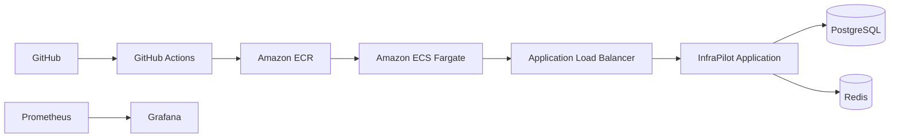
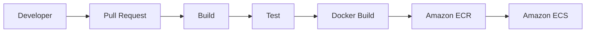
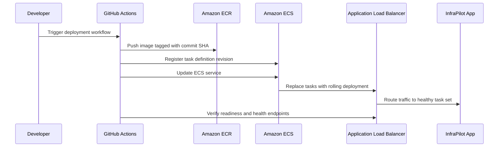
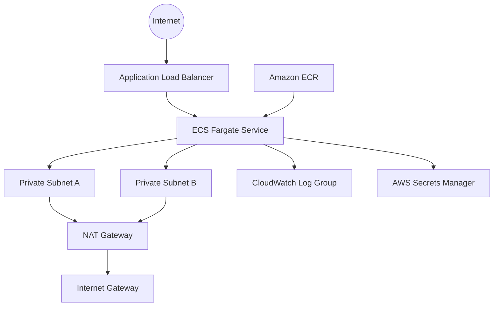
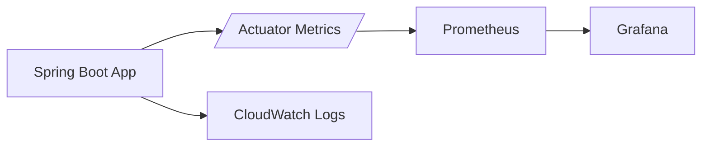

# InfraPilot

InfraPilot is a production-grade cloud-native backend platform showcase built to demonstrate modern Java backend engineering, AWS infrastructure, CI/CD automation, observability, security, containerization, and operational maturity.

It is intentionally not a business application. The API surface is deliberately small so the repository can focus on platform concerns rather than domain complexity.

## What this repository demonstrates

- Java 21 and Spring Boot 3.x
- Maven-based build and packaging
- PostgreSQL with Flyway migrations
- Redis integration and health validation
- Actuator, Micrometer, Prometheus, JVM metrics, HTTP metrics, database metrics, and Redis metrics
- Correlation IDs, structured logging, global exception handling, validation, and DTO-based layering
- Docker, Docker Compose, GitHub Actions, Terraform, ECS Fargate, ECR, ALB, CloudWatch, and Secrets Manager

## API Surface

- `GET /api/v1/health`
- `GET /api/v1/version`
- `GET /api/v1/info`
- `GET /api/v1/cache-test`
- `GET /api/v1/db-test`

Actuator endpoints exposed for operations:

- `GET /actuator/health`
- `GET /actuator/info`
- `GET /actuator/prometheus`
- `GET /actuator/metrics`

## Architecture Overview



## CI/CD Pipeline



## Deployment Flow



## AWS Infrastructure Diagram



## Monitoring Architecture



## Repository Layout

```text
infra-pilot
├── application
├── docker
├── terraform
├── monitoring
├── docs
├── .github
└── README.md
```

## Local Setup

### Prerequisites

- Java 21
- Maven 3.9+
- Docker Desktop
- PostgreSQL and Redis if you want to run the application outside Compose

### Run locally with Maven

Set the required environment variables first:

- `INFRAPILOT_APP_NAME`
- `INFRAPILOT_APP_VERSION`
- `INFRAPILOT_GIT_COMMIT_SHA`
- `INFRAPILOT_BUILD_TIMESTAMP`
- `INFRAPILOT_HOSTNAME`
- `INFRAPILOT_ENVIRONMENT`
- `SPRING_DATASOURCE_URL`
- `SPRING_DATASOURCE_USERNAME`
- `SPRING_DATASOURCE_PASSWORD`
- `SPRING_REDIS_HOST`
- `SPRING_REDIS_PORT`
- `SPRING_REDIS_PASSWORD`

Then run:

```bash
mvn -pl application -am spring-boot:run
```

### Health check

```bash
curl http://localhost:8080/api/v1/health
```

## Docker Setup

Build and start the full local stack:

```bash
docker compose up --build
```

Services:

- Application: `http://localhost:8080`
- Prometheus: `http://localhost:9090`
- Grafana: `http://localhost:3000`

Default local credentials for Grafana:

- Username: `admin`
- Password: `admin`

## Terraform Setup

Terraform provisions:

- VPC, public subnets, private subnets, route tables, IGW, NAT gateway
- Security groups for ALB and ECS tasks
- ECR repository
- ECS cluster and Fargate service
- Application Load Balancer
- CloudWatch log group
- Secrets Manager secrets
- IAM task execution and task roles

See the full step-by-step guide in [docs/terraform.md](docs/terraform.md).

Example:

```bash
cd terraform
terraform init
terraform plan \
  -var="container_image=123456789012.dkr.ecr.us-east-1.amazonaws.com/infrapilot:latest" \
  -var="app_version=1.0.0" \
  -var="git_commit_sha=abc123" \
  -var="build_timestamp=2026-06-14T00:00:00Z" \
  -var="hostname=infrapilot-prod" \
  -var="runtime_environment=prod" \
  -var="db_url=jdbc:postgresql://your-postgres.example.com:5432/infrapilot" \
  -var="db_username=infrapilot" \
  -var="redis_host=your-redis.example.com"
```

### Secrets Manager workflow

Terraform creates empty secret containers. Populate secret values before deployment:

- `database_password`
- `redis_password`
- `application_metadata` if you want to store additional runtime metadata

## AWS Deployment Guide

1. Apply Terraform.
2. Push an image to ECR.
3. Trigger the deployment workflow.
4. Confirm the ECS service reaches `stable`.
5. Verify `/actuator/health/readiness` and `/api/v1/health` through the ALB.

### Rolling deployment strategy

- ECS service uses rolling updates.
- Minimum healthy percent is 100.
- Maximum percent is 200.
- ALB health checks use `/actuator/health/readiness`.
- Deployment fails if health checks do not recover.

### Rollback

- Re-run the deployment workflow with the previous image tag.
- Or update the ECS service to the prior task definition revision.
- ECS and ALB health checks will drain unhealthy tasks before routing traffic to the reverted revision.

## Monitoring Guide

- Spring Boot Actuator exposes health, info, metrics, and Prometheus endpoints.
- Prometheus scrapes the application at `/actuator/prometheus`.
- Grafana dashboards are provisioned from `monitoring/grafana/dashboards`.

Dashboards included:

- JVM
- Memory
- CPU
- HTTP Requests
- Error Rate

## CI/CD Guide

### PR validation

The PR workflow runs:

- Build
- Unit tests
- Integration tests
- Coverage report generation

### Build and push

The main branch workflow:

- Builds the application jar
- Builds the Docker image
- Tags the image with the git commit SHA
- Pushes the image to Amazon ECR

### Deployment

The deployment workflow:

- Pulls the current ECS task definition
- Registers a new revision with the target image
- Updates the ECS service
- Waits for stability
- Verifies health checks against the ALB

## Troubleshooting

- If `/api/v1/health` returns an error, check PostgreSQL and Redis connectivity first.
- If readiness fails, inspect `/actuator/health/readiness` for the specific dependency that is down.
- If the container starts but immediately exits, verify all `INFRAPILOT_*` environment variables are present.
- If Grafana dashboards are empty, confirm Prometheus can reach `app:8080` or the deployed ALB endpoint.
- If Flyway fails, check that the PostgreSQL schema is empty or that the migration history table matches the expected version.

## Documentation

Additional supporting notes live in `docs/`.
