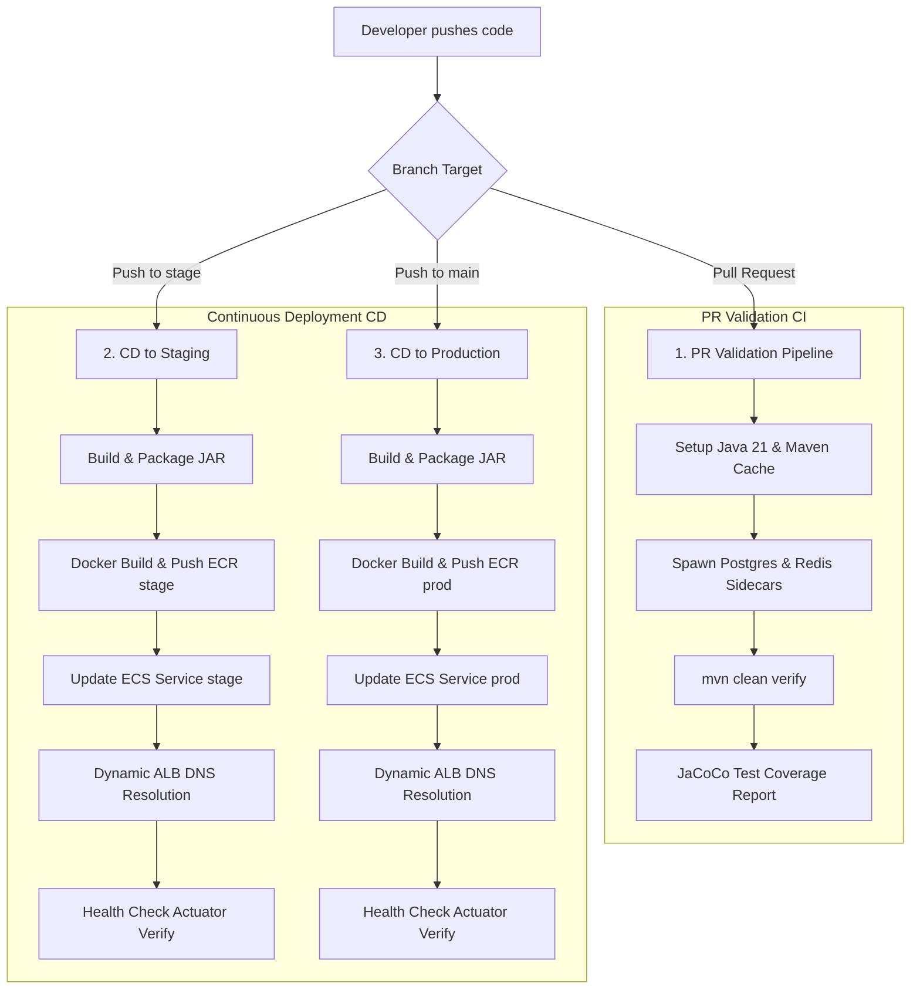

# InfraPilot API - Automated Software Delivery & CI/CD Platform

InfraPilot API is a production-grade cloud-native Spring Boot application showcase designed to demonstrate modern software delivery automation, continuous integration (CI), continuous deployment (CD), and containerization best practices.

The primary focus of this repository is on the **automated release engineering pipeline**—taking code from a pull request, validating it under realistic database conditions, packaging it into a minimal-footprint container, and deploying it with zero downtime to AWS ECS.

---

## 🚀 Software Delivery & CI/CD Pipelines

Our software delivery lifecycle is governed by automated pipelines in `.github/workflows/` that coordinate continuous testing and target-environment deployments.



### 1. PR Validation Pipeline (`pr-validation.yml`)
Runs automatically on pull requests targeting `stage` or `main`.
* **Database Sidecars**: Spawns actual containerized PostgreSQL 16 and Redis 7.4 databases in the runner workspace using GitHub Actions Services.
* **Continuous Integration**: Executes integration tests (`*IT.java`) against these running database engines.
* **Quality Gates**: Compiles code using JDK 21 and measures test coverage using **JaCoCo**, uploading reports as build artifacts.

### 2. Automated CD Pipeline (`ci-cd-auto.yml`)
Runs on direct commits or merged pull requests into target environment branches.
* **Environment Mapping**: 
  * `stage` branch $\rightarrow$ Staging (`infrapilot-stage` ECR / ECS Cluster)
  * `main` branch $\rightarrow$ Production (`infrapilot-prod` ECR / ECS Cluster)
* **Secure Containerization**: Builds a multi-stage distroless Docker image containing *only* the compiled application jar and Java runtime. No shell or package manager is present, reducing the security attack surface.
* **Self-Healing Deployments**:
  * Registers a new revision of the Fargate Task Definition with the built image tag.
  * Triggers an ECS rolling update.
  * Queries AWS CLI (`aws elbv2 describe-load-balancers`) dynamically to retrieve the live Load Balancer DNS name, bypassing hardcoded variables.
  * Verifies health status via `/actuator/health/readiness` and `/api/v1/health` before completing the workflow.

### 3. Manual Promotion Pipeline (`deploy.yml`)
Allows manual trigger of deployments via `workflow_dispatch` in the GitHub UI, prompting for:
* Target environment selection (`stage` or `prod`).
* Target Docker image tag (e.g. `latest` or specific git commit SHA).

---

## 💻 Tech Stack & Architecture

* **Framework**: Spring Boot 3.4.6, Java 21 (Eclipse Temurin)
* **Build System**: Maven (parent project with modular `application` subdirectory)
* **Database Migrations**: Flyway (manages database schema evolution on startup)
* **Metrics & Observability**: Spring Boot Actuator, Micrometer Prometheus metrics
* **Container Base**: Google Distroless Java 21 Debian 12 image

---

## 🛠️ Local Development & Setup

### Prerequisites
* JDK 21 (Temurin recommended)
* Maven 3.9+
* Docker Desktop (for Compose orchestration)

### 1. Running Locally via Maven
Ensure you have running instances of PostgreSQL and Redis locally, then export the following variables:
```bash
export INFRAPILOT_ENVIRONMENT=local
export SPRING_DATASOURCE_URL=jdbc:postgresql://localhost:5432/infrapilot
export SPRING_DATASOURCE_USERNAME=postgres
export SPRING_DATASOURCE_PASSWORD=postgres
export SPRING_REDIS_HOST=localhost
export SPRING_REDIS_PORT=6379
```

Run the application:
```bash
./mvnw -pl application -am spring-boot:run
```

### 2. Running Locally via Docker Compose
To boot the full application environment (App + Postgres + Redis + Prometheus + Grafana):
```bash
docker compose up --build
```
* **Application URL**: `http://localhost:8080`
* **Health Endpoint**: `http://localhost:8080/api/v1/health`
* **Actuator Health**: `http://localhost:8080/actuator/health/readiness`

---

## 📁 Repository Layout
```text
infra-pilot-api
├── .github/workflows/    # CI/CD Workflows (PR Validation, CD Auto, Manual Deploy)
├── application/          # Core Spring Boot Maven module (Source code & tests)
├── docker/               # Multi-stage distroless Dockerfile configuration
├── monitoring/           # Local Prometheus & Grafana configurations
├── pom.xml               # Parent Maven Project Object Model
└── README.md             # Software delivery & pipeline documentation
```
