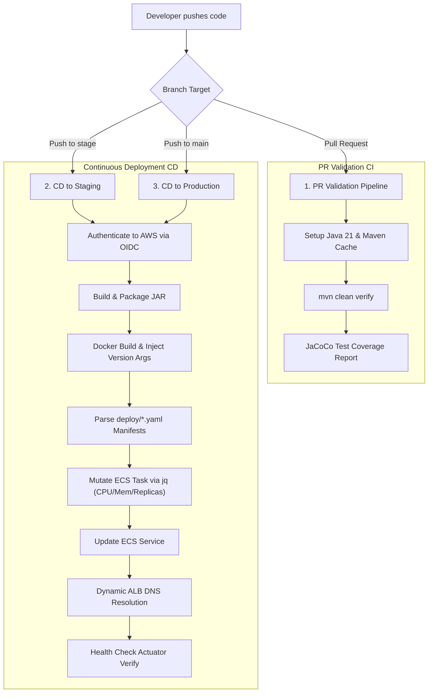

# InfraPilot API - Automated Software Delivery & CI/CD Platform

InfraPilot API is a production-grade cloud-native Spring Boot application showcase designed to demonstrate modern software delivery automation, continuous integration (CI), continuous deployment (CD), and containerization best practices.

The primary focus of this repository is on the **automated release engineering pipeline**—taking code from a pull request, validating it, packaging it into a minimal-footprint container, and securely deploying it with zero downtime to AWS ECS using industry-standard configurations and keyless authentication.

---

## 🚀 Software Delivery & CI/CD Pipelines

Our software delivery lifecycle is governed by automated pipelines in `.github/workflows/` that coordinate continuous testing and target-environment deployments.



### 1. PR Validation Pipeline (`pr-validation.yml`)
Runs automatically on pull requests targeting `stage` or `main`.
* **Continuous Integration**: Executes tests and builds the single-module maven project.
* **Quality Gates**: Compiles code using JDK 21 and measures test coverage using **JaCoCo**, uploading reports as build artifacts.

### 2. Automated CD Pipeline (`ci-cd-auto.yml`)
Runs on direct commits or merged pull requests into target environment branches.
* **Keyless OIDC Security**: Completely eliminates long-lived AWS IAM access keys. Pipelines authenticate dynamically using GitHub Actions OpenID Connect (OIDC) federation.
* **Developer-Driven Declarative Configuration**: Follows industry standards by empowering developers to control their own service scaling. Terraform provides the base infrastructure, but this pipeline parses `deploy/stage.yaml` or `deploy/prod.yaml` manifests and dynamically mutates the AWS task definition using `jq` to apply custom CPU, memory, and desired task counts.
* **Secure Containerization**: Builds a multi-stage distroless Docker image containing *only* the compiled application jar and Java runtime. Injects the Git Commit SHA, Run Number, and Build Timestamp dynamically as `--build-arg` to power the `/api/v1/version` live endpoint.
* **Self-Healing Deployments**:
  * Registers a mutated revision of the Fargate Task Definition with the built image tag.
  * Triggers an ECS rolling update.
  * Queries AWS CLI dynamically to retrieve the live Load Balancer DNS name.
  * Verifies health status via `/actuator/health` before completing the workflow.

### 3. Manual Promotion Pipeline (`deploy.yml`)
Allows manual trigger of deployments via `workflow_dispatch` in the GitHub UI, prompting for target environments (`stage` or `prod`) and image tags.

---

## 🛠 Tech Stack & Architecture

* **Framework**: Spring Boot 3.4.6, Java 21 (Eclipse Temurin)
* **Build System**: Maven (Standard Single-Module Project)
* **Metrics & Observability**: Spring Boot Actuator, Micrometer
* **Container Base**: Google Distroless Java 21 Debian 12 image
* **Authentication**: GitHub Actions OIDC

---

## 💻 Local Development & Setup

### Prerequisites
* JDK 21 (Temurin recommended)
* Maven 3.9+
* Docker Desktop (optional, for manual local builds)

### Running Locally via Maven
Since the multi-module structure and external database dependencies have been flattened and removed, running the app locally is incredibly fast and completely self-contained.

Run the application from the root directory:
```bash
./mvnw spring-boot:run
```

* **Application URL**: `http://localhost:8080`
* **Version Endpoint**: `http://localhost:8080/api/v1/version`
* **Actuator Health**: `http://localhost:8080/actuator/health`

---

## 📂 Repository Layout
```text
infra-pilot-api
├── .github/workflows/    # CI/CD Workflows (OIDC, PR Validation, CD Auto, Deploy)
├── deploy/               # Declarative developer manifests (stage.yaml, prod.yaml)
├── docker/               # Multi-stage distroless Dockerfile configuration
├── src/                  # Core Spring Boot Application Source Code
├── pom.xml               # Standard Maven Project Object Model
└── README.md             # Software delivery & pipeline documentation
```    # Software delivery & pipeline documentation
```
