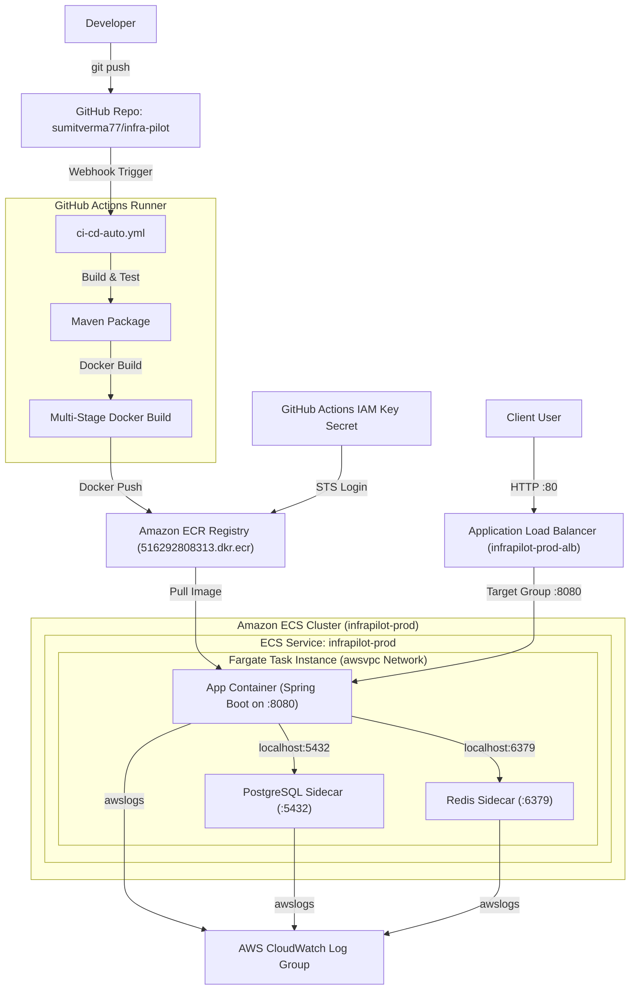
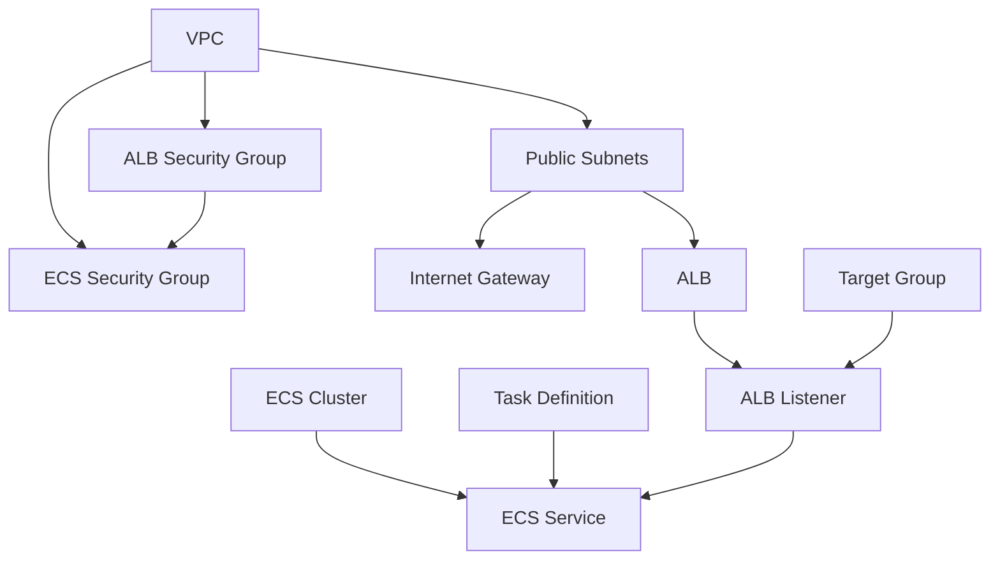

# InfraPilot Architecture Deep Dive
**Author:** Principal Cloud Architect & Lead SRE  
**Role:** Engineering Mentorship & Operational Blueprint

This document serves as a complete engineering deep dive for **InfraPilot**. It covers every core design decision, operational mechanism, cloud trade-off, security model, and scaling pattern from the perspective of a Backend Engineer, DevOps Engineer, Cloud Engineer, Solutions Architect, and SRE.

---

## PART 1 - PROJECT OVERVIEW & DATA FLOW

### Complete Architecture Map
The diagram below illustrates the structural layout of InfraPilot, showing how code moves from a commit to a live task behind the load balancer, utilizing local sidecars to bypass external service costs:



---

### End-to-End Lifecycle

#### 1. Code Push & Build Trigger
* **The Action:** The developer runs `git push origin main`.
* **Path Filtering:** GitHub receives the push and evaluates path-based filters. If files under `application/`, `docker/`, or `pom.xml` are changed, the `Automated CI/CD Pipeline` triggers.
* **Compilation:** The GitHub Actions runner compiles the Spring Boot application using Maven: `mvn clean package -DskipTests`.

#### 2. Image Build & Push
* **Credentials Configuration:** The runner logs into AWS using your IAM User credentials stored securely in GitHub Secrets.
* **ECR Login:** The runner authenticates with your Amazon ECR Registry.
* **Docker Compilation:** The runner executes a multi-stage Docker build, generating a minimal, secure image tagged with the unique `GITHUB_SHA` and `latest`.
* **Registry Upload:** The image is pushed to ECR.

#### 3. Task Deployment & Verification
* **Task Definition update:** The pipeline pulls the current ECS Task Definition, updates the target image URI for the `infrapilot` container, and registers a new revision (e.g. `infrapilot-prod:5`).
* **Service Rollout:** The pipeline calls the AWS ECS API to update the service using a **rolling deployment strategy**.
* **Startup Sequence:** ECS launches a new Fargate task instance. The container agent allocates a public IP and pulls the three container images defined in the task definition (Spring Boot app, PostgreSQL, and Redis).
* **Sidecar Initialization:** The sidecars spin up. The Spring Boot container connects to PostgreSQL (`localhost:5432`) and Redis (`localhost:6379`) over the local loopback interface.
* **Health Check & Traffic Routing:** The ALB begins polling the `/actuator/health/readiness` endpoint. Once the new task is marked healthy, the ALB routes traffic to it, and ECS gracefully shuts down the old task.

---

## PART 2 - WHY THIS ARCHITECTURE?

### 1. ECS (Fargate) vs. EKS (Elastic Kubernetes Service)
* **Selected:** ECS Fargate.
* **Why:** ECS provides a lightweight, serverless orchestrator native to AWS. It has a very low learning curve and requires zero master-node configuration or baseline control plane fees.
* **Rejected Alternative:** EKS (Kubernetes) has high baseline costs (approx. $73/month just for the control plane, plus worker node costs) and requires significant operational complexity (managing ingress controllers, node groups, and kubeconfig credentials).

### 2. Fargate vs. EC2 (Elastic Compute Cloud)
* **Selected:** Fargate.
* **Why:** Fargate is a serverless compute engine. You don't have to manage OS patches, secure the underlying AMI, or configure EC2 Auto-Scaling groups.
* **Rejected Alternative:** Self-managed EC2 instances require you to patch the OS and configure Auto-Scaling groups yourself, increasing operational overhead.

### 3. Local Sidecars vs. External Services (RDS & ElastiCache)
* **Selected:** Local Sidecars (PostgreSQL & Redis inside the Fargate task).
* **Why:** Bypasses the high costs of running AWS managed databases.
* **Rejected Alternative:** An RDS database and an ElastiCache node cost a minimum of $30-$40/month. Additionally, to access them securely, you must configure private subnets and a NAT Gateway (which costs an additional $32/month base fee). Running sidecars in public subnets with security group blocks avoids this cost entirely.

---

## PART 3 - SOURCE CODE DEEP DIVE

### Core Package Layout
* **`com.sumitverma.infrapilot.controller`**: Entry point for HTTP REST requests. Maps incoming payloads and routes them.
* **`com.sumitverma.infrapilot.service`**: Holds the business logic. Coordinates database reads/writes and cache validation.
* **`com.sumitverma.infrapilot.repository`**: Layer interfacing with PostgreSQL using Spring Data JPA.
* **`com.sumitverma.infrapilot.entity`**: Database table mapping definitions.
* **`com.sumitverma.infrapilot.dto`**: Data Transfer Objects defining serialization contracts.
* **`com.sumitverma.infrapilot.config`**: Environment and runtime configuration beans.
* **`com.sumitverma.infrapilot.exception`**: Global error handling logic.

### Spring Boot Annotations Explained

* **`@RestController`:** Tells Spring to register the class as an endpoint handler and serialize returned objects to JSON (using Jackson).
* **`@Service`:** Registers the class in Spring's Application Context as a candidate for Dependency Injection.
* **`@Transactional`:** Intercepts method calls. Spring starts a database transaction before entering the method, joins any active transaction, and commits it upon success (or rolls back on runtime exceptions).
* **`@Entity`:** JPA marker indicating that the class represents a database table schema.
* **`@PrePersist`:** Instructs Hibernate to execute the decorated method (e.g. setting `createdAt = Instant.now()`) right before executing the `INSERT` SQL statement.

---

## PART 4 - DOCKER DEEP DIVE

### Build Stage Optimization
Our `Dockerfile` utilizes a **multi-stage build** to optimize image sizes:

```dockerfile
# Stage 1: Build compilation environment
FROM maven:3.9.9-eclipse-temurin-21 AS build
WORKDIR /workspace
COPY pom.xml .
COPY application/pom.xml application/pom.xml
COPY application/src application/src
RUN mvn -pl application -am -DskipTests package

# Stage 2: Runtime production environment
FROM gcr.io/distroless/java21-debian12:nonroot
WORKDIR /app
COPY --from=build /workspace/application/target/*-exec.jar /app/app.jar
EXPOSE 8080
ENTRYPOINT ["java", "-jar", "/app/app.jar"]
```

#### Why we use a Distroless Base Image:
* **Security:** Distroless images contain *only* the minimal dependencies required to run your application (no package manager, no shell, no utilities like `curl` or `bash`). If an attacker exploits a remote code execution vulnerability in your Java application, they cannot run shell commands or download malware packages.
* **Size:** Reduces the production image size from **~600MB** to **~150MB**, saving registry storage and accelerating ECR download times.
* **Non-Root:** The image defaults to a `nonroot` system user (UID `65532`), preventing container breakout exploits from obtaining root access to the host.

---

## PART 5 - TERRAFORM DEEP DIVE

### Resource Dependency Graph



---

## PART 6 - AWS DEEP DIVE

### Resource Explanations

1. **VPC (`aws_vpc.this`):** A custom virtual private network isolating your resources from other AWS accounts.
2. **Public Subnets (`aws_subnet.public`):** IP ranges in different Availability Zones (AZs) that can route traffic to and from the internet.
3. **Internet Gateway (`aws_internet_gateway.this`):** Enables public internet routing for the VPC.
4. **Security Groups:** 
   * **ALB SG:** Allows port `80` (HTTP) and `443` (HTTPS) from any IP (`0.0.0.0/0`).
   * **ECS SG:** Allows port `8080` *only* from the ALB Security Group. This ensures your Spring Boot container is protected from direct internet scans.
5. **Application Load Balancer (`aws_lb.this`):** Receives client requests and distributes them across healthy tasks.
6. **ECS Service (`aws_ecs_service.app`):** Maintains the desired number of running task instances, replacing crashed tasks and registering them with the target group.
7. **ECS Task Definition (`aws_ecs_task_definition.app`):** The container blueprint defining the primary application, the Postgres database sidecar, and the Redis cache sidecar.
8. **CloudWatch Log Groups (`aws_cloudwatch_log_group.app`):** Stores logs from the app, database, and cache containers.

---

## PART 7 - ECS DEPLOYMENT FLOW

### Rolling Deployment Strategy
During deployment, ECS Fargate applies a **rolling update** strategy:

1. **Provisioning:** Launches new Fargate tasks using the new revision (e.g. `infrapilot-prod:2`).
2. **Health Check:** The ALB target group starts polling the new tasks via `/actuator/health/readiness`.
3. **Draining:** Once marked healthy, the ALB routes new traffic to the new tasks. It stops routing traffic to the old tasks (Revision 1), allowing active connections to drain (default: 300 seconds).
4. **Termination:** ECS sends `SIGTERM` to the old tasks and shuts them down, maintaining your `desired_count` throughout the deployment process.

---

## PART 8 - CI/CD DESIGN & GITOPS

We restructured your GitHub Actions to follow industry-standard path-filtering and dynamic variable mapping:

```
                  ┌──────────────────────┐
                  │      git push        │
                  └──────────┬───────────┘
                             │
            ┌────────────────┴────────────────┐
            ▼                                 ▼
   [application/** files]            [terraform/** files]
            │                                 │
            ▼                                 ▼
   [ci-cd-auto.yml]                  [terraform-check.yml]
  - Maven Compile & Test            - terraform fmt
  - Docker Multi-Stage Build        - terraform init
  - Push ECR & Deploy to ECS        - terraform validate
```

### Path Filtering (Separation of Concerns)
* The Java build/deploy pipelines only run when files under `application/`, `docker/`, or `pom.xml` change.
* The Terraform validation pipeline only runs when infrastructure files under `terraform/` change.
* Changing `README.md` or files inside `monitoring/` will skip all workflows, saving pipeline run time.

---

## PART 9 - SRE DEBUGGING PLAYBOOK

### 1. ECS Task Keeps Restarting (Exit Code 1 / 137)
* **Check Stopped Reason:**
  ```bash
  aws ecs describe-tasks --cluster infrapilot-prod --tasks <TASK_ID> --query "tasks[0].stoppedReason"
  ```
* **Read CloudWatch Logs:**
  Since the container is distroless (no shell), read logs via CloudWatch:
  ```bash
  aws logs get-log-events --log-group-name "/ecs/infrapilot-prod" --log-stream-name "app/infrapilot/<TASK_ID>"
  ```
* **If Exit Code 137:** Out-Of-Memory. Increase Fargate task memory in your `variables.tf` (e.g. to `4096`).

### 2. ALB Health Checks Failing (HTTP 503)
* Check application logs. It is likely that the Postgres or Redis sidecars took too long to initialize, causing Spring Boot Actuator's `db` or `redis` readiness check to return a failure status.
* **Fix:** Increase the `health_check_grace_period_seconds` in `ecs.tf` to give the database/cache sidecars enough time to start before the ALB target group begins checking their health.

---

## PART 10 - PRODUCTION READINESS REVIEW

### SRE Assessment Matrix

| Current Strengths | Current Weaknesses | Recommendations |
| :--- | :--- | :--- |
| **Secure distroless builds:** Minimal vulnerability surface area. | **Ephemeral Storage:** Database data is lost if the Fargate task restarts. | Migrate database state to **AWS RDS (PostgreSQL)** for production persistence. |
| **Least Privilege Network:** ECS containers cannot be accessed directly from the web. | **Single Point of Failure:** Running only 1 task limits high availability. | Increase `desired_count` to `2` and place tasks across multiple AZs. |
| **Zero Hardcoding:** All configurations resolved via GitHub variables. | **Secrets Exposure:** Postgres passwords are in plaintext env variables. | Reference passwords from **AWS Secrets Manager** using ECS Secrets integration. |

---

## PART 11 - MULTI-ENVIRONMENT DESIGN (Dev, Stage, Prod)

To transition this single environment into a multi-environment architecture, follow this structure:

### 1. Terraform Folder Structure (Directory-based Environments)
Using directories is the industry standard for Terraform because it completely isolates state files, preventing changes in `dev` from accidentally destroying resources in `prod`:

```
terraform/
├── environments/
│   ├── dev/
│   │   ├── main.tf        # References modules/vpc and modules/ecs
│   │   ├── variables.tf   # Dev specific values
│   │   └── terraform.tfvars
│   └── prod/
│       ├── main.tf
│       ├── variables.tf
│       └── terraform.tfvars
└── modules/
    ├── vpc/
    │   ├── main.tf
    │   └── variables.tf
    └── ecs/
        ├── main.tf
        └── variables.tf
```

---

## PART 12 - CLOUD MIGRATION MATRIX

If you need to migrate the InfraPilot workload to another cloud provider, here is how the AWS components map to other ecosystems:

| AWS Resource | Google Cloud (GCP) | Microsoft Azure | Raw Kubernetes (K8s) |
| :--- | :--- | :--- | :--- |
| **ECR** | Artifact Registry | Azure Container Registry | Docker Hub / Harbor |
| **ECS Fargate** | Cloud Run (Serverless) | Azure Container Apps | Kubernetes Pod (Fargate-like) |
| **ALB** | Cloud Load Balancing | Azure Application Gateway | Nginx Ingress Controller |
| **RDS** | Cloud SQL for PostgreSQL | Azure Database for PostgreSQL | StatefullSet with Postgres Operator |
| **ElastiCache** | Memorystore for Redis | Azure Cache for Redis | Redis Sentinel Deployment |
| **CloudWatch** | Cloud Logging / Monitoring | Azure Monitor / Log Analytics | Prometheus & Grafana |

---

## PART 13 - INTERVIEW MODE (Mentorship Q&A)

### Junior Level
* **Q:** Why can the Spring Boot container connect to Postgres at `localhost:5432` if they are in different Docker containers?
* **A:** Because both containers are defined inside the same ECS Task Definition sharing the `awsvpc` network mode. In ECS Fargate, all containers in the same task share the same network namespace and local loopback interface, meaning they behave as if they are running on the same local host.

### Mid Level
* **Q:** What is the difference between the **ECS Task Role** and the **ECS Task Execution Role**?
* **A:** 
  * The **Task Execution Role** is used by the ECS container agent *itself* before your application starts (e.g., to authenticate with ECR, download your image, and setup CloudWatch logging stream).
  * The **Task Role** is assumed by your *application code* after the container starts (e.g., if your Java code needs to read files from an S3 bucket or write to a database table).

### Senior Level
* **Q:** How would you implement zero-downtime deployment for a database migration (like Flyway) in our rolling upgrade pipeline?
* **A:** In a rolling update, the old task (Revision 1) and the new task (Revision 2) run simultaneously during the transition phase. To prevent errors:
  1. Database migrations must follow the **Expand/Contract** design pattern. Changes must be backward-compatible (e.g. if you rename a column, you first add the new column, write to both, copy data, and only delete the old column in a subsequent release).
  2. The Flyway migration should execute *before* the application starts (usually during the build or as an ECS temporary task) so the database schema is updated before any container tries to connect.
